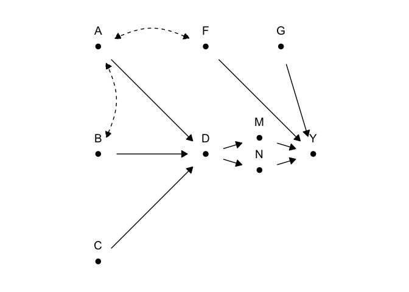
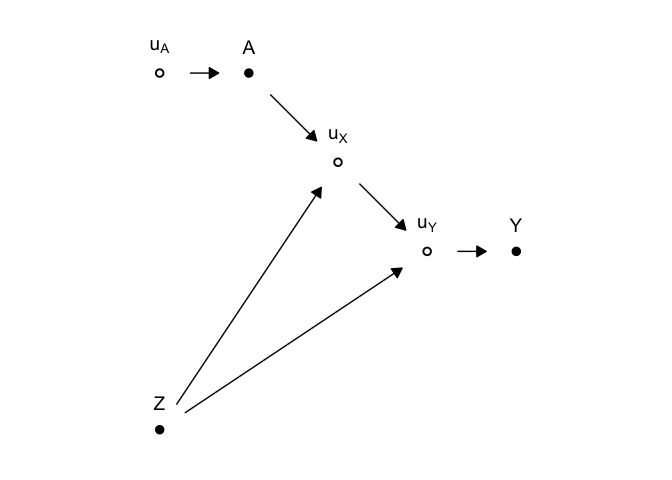
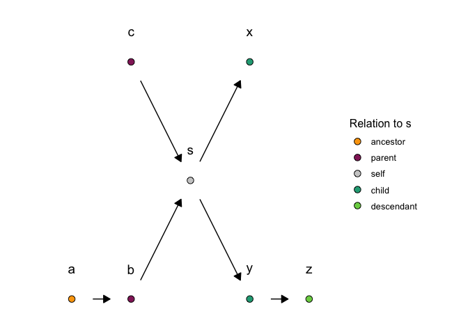

<!-- README.md is generated from README.Rmd. Please edit that file -->

# smokeutils

<!-- badges: start -->

<!-- badges: end -->

## Installation

Install the development version from [GitHub](https://github.com/) with:

``` r
# install.packages("devtools")
devtools::install_github("jasonmtroos/smokeutils")
```

## Examples

``` r
library(tidyverse)
#> ── Attaching packages ──────────────────────────────────────────────────────────── tidyverse 1.2.1 ──
#> ✔ ggplot2 3.2.1     ✔ purrr   0.3.2
#> ✔ tibble  2.1.3     ✔ dplyr   0.8.3
#> ✔ tidyr   1.0.0     ✔ stringr 1.4.0
#> ✔ readr   1.3.1     ✔ forcats 0.4.0
#> ── Conflicts ─────────────────────────────────────────────────────────────── tidyverse_conflicts() ──
#> ✖ dplyr::filter() masks stats::filter()
#> ✖ dplyr::lag()    masks stats::lag()
library(dagitty)
library(ggdag)
#> 
#> Attaching package: 'ggdag'
#> The following object is masked from 'package:ggplot2':
#> 
#>     expand_scale
#> The following object is masked from 'package:stats':
#> 
#>     filter
library(smokeutils)

dag("{Y <- G; Y <- M; Y <- N; M <- D -> N; 
         C -> D; B -> D <- A; A  <-> B; A <-> F; F -> Y;}") %>%
  tidy_dagitty2(rads = pi/2) %>%
  move_node(G, .7, 1) %>%
  move_node(C, -1, -1) %>%
  move_node(B, -1, 0) %>%
  move_node(A, -1, 1) %>%
  move_node(F, 0, 1) %>%
  move_node(M, .5, .15) %>%
  move_node(N, .5, -.15) %>%
  smoke_ggplot2_basic_dag()
```



``` r
dag("
{
  uA -> A -> uX -> uY -> Y; uY <- Z -> uX; 
  uA [unobserved];
  uX [unobserved];
  uY [unobserved];
}") %>%
  tidy_dagitty2(pi/2) %>%
  move_node(uX, 0, .5) %>%
  smoke_ggplot2_basic_dag()
```



``` r
dag("{a -> b -> s -> y ->  z; c -> s; s -> x;}") %>%
  tidy_dagitty2(pi/2) %>%
  move_node(c, -.5, 1) %>%
  augment(node_ancestors, colify = FALSE, 's') %>%
  augment(node_parents, colify = FALSE, 's') %>%
  augment(node_descendants, colify = FALSE, 's') %>%
  augment(node_children, colify = FALSE, 's') %>%
  mutate(parent = ifelse(label == 's', 'self', parent)) %>%
  mutate(relation = coalesce(parent, ancestor, children, descendant),
         relation = factor(relation, ordered = TRUE) %>%
           fct_relevel('ancestor', 'parent', 'self', 'child', 'descendant')) %>%
  smoke_ggplot2_base(fill = relation) +
  ggdag::geom_dag_point(
    mapping = ggplot2::aes(shape = latent), size = 3, show.legend = TRUE,
    stroke = .5, shape = 21, colour = 'black') +
  geom_dag_edges2() +
  geom_dag_text2(nudge_y = .25) +
  guides(shape = 'none') +
  labs(fill = 'Relation to s') +
  scale_fill_manual(
    values = c(
      viridis::viridis(2, begin = .4, end = .8, direction = -1,option = 'B'),
      gray(.8), 
      viridis::viridis(2, begin = .6, end = .8, direction = 1, option = 'D')))
```


